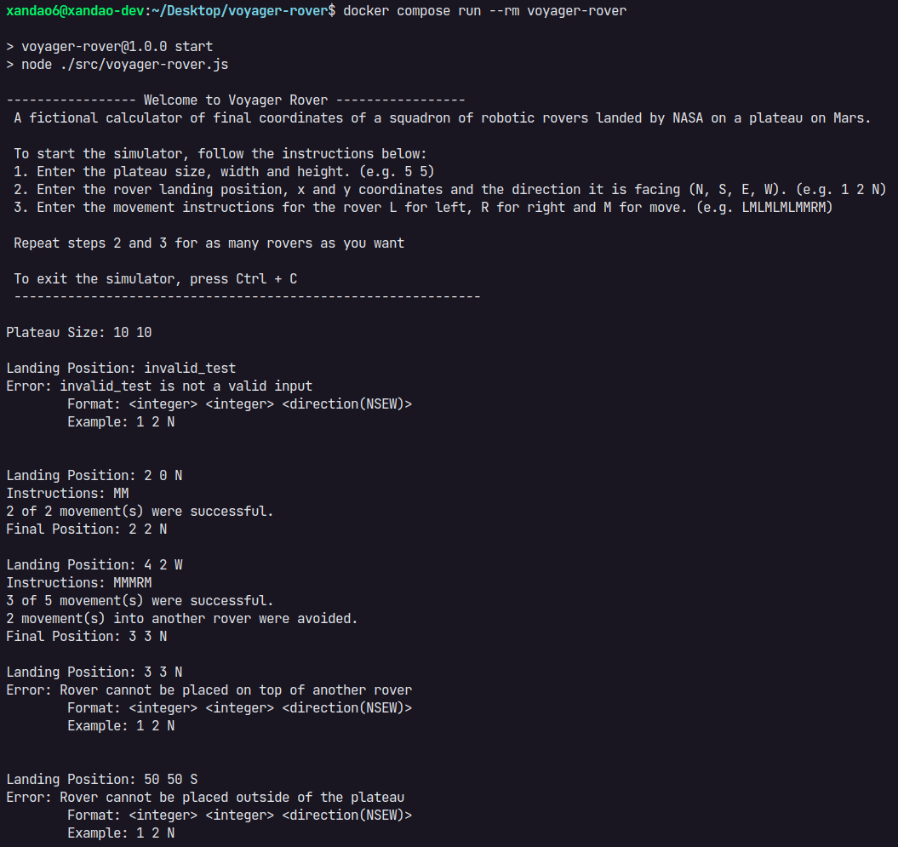
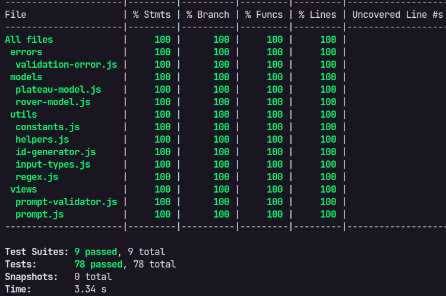

<br />
<p align="center">
  <h3 align="center">Voyager Rover</h3>

  <p align="center">
    A fictional calculator of final coordinates of a squadron of robotic rovers landed by NASA on a plateau on Mars.
    <br />
    <a href="https://github.com/xandao-dev/voyager-rover"><strong>Explore the docs »</strong></a>
    <br />
    <br />
    <a href="https://github.com/xandao-dev/voyager-rover/issues">Report Bug</a>
    ·
    <a href="https://github.com/xandao-dev/voyager-rover/issues">Request Feature</a>
  </p>
</p>

<!-- TABLE OF CONTENTS -->
<details open="open">
  <summary>Table of Contents</summary>
  <ol>
    <li>
      <a href="#about-the-project">About The Project</a>
      <ul>
        <li><a href="#mars-rover">Mars Rover</a></li>
        <li><a href="#input">Input</a></li>
        <li><a href="#output">Output</a></li>
        <li><a href="#rover-data-example">Rover Data Example</a></li>
        <li><a href="#features">Features</a></li>
        <li><a href="#built-with">Built With</a></li>
      </ul>
    </li>
    <li>
      <a href="#getting-started">Getting Started</a>
      <ul>
        <li><a href="#installation">Installation</a></li>
      </ul>
    </li>
    <li><a href="#usage">Usage</a></li>
    <li><a href="#usage">Debug</a></li>
    <li><a href="#roadmap">Roadmap</a></li>
    <li><a href="#contributing">Contributing</a></li>
    <li><a href="#license">License</a></li>
    <li><a href="#contact">Contact</a></li>
  </ol>
</details>

<!-- ABOUT THE PROJECT -->

## About The Project

<div align="center">
  <a href="https://github.com/xandao-dev/voyager-rover">
    
     
  </a>
</div>

### Mars Rover

A squad of robotic rovers are to be landed by NASA on a plateau on Mars. <br />

This plateau, which is curiously rectangular, must be navigated by the rovers so that their on-board cameras can get a complete view of the surrounding terrain to send back to Earth. <br />

A rover’s position and location is represented by a combination of x and y co-ordinates and a letter representing one of the four cardinal compass points. The plateau is divided up into a grid to simplify navigation. An example position might be 0, 0, N, which means the rover is in the bottom left corner and facing North. <br />

In order to control a rover , NASA sends a simple string of letters. The possible letters are ‘L’, ‘R’ and ‘M’. ‘L’ and ‘R’ makes the rover spin 90 degrees left or right respectively, without moving from its current spot. ‘M’ means move forward one grid point, and maintain the same heading. <br />

Assume that the square directly North from (x, y) is (x, y 1).

### Input

The first line of input is the upper-right coordinates of the plateau, the lower-left coordinates are assumed to be 0,0. <br />

The rest of the input is information pertaining to the rovers that have been deployed. Each rover has two lines of input. The first line gives the rover’s position, and the second line is a series of instructions telling the rover how to explore the plateau. <br />

The position is made up of two integers and a letter separated by spaces, corresponding to the x and y co-ordinates and the rover’s orientation. <br />

Each rover will be finished sequentially, which means that the second rover won’t start to move until the first one has finished moving.

### Output

The output for each rover should be its final co-ordinates and heading.

### Rover Data Example

Example 1 - Regular

```
Plateau Size: 10 10
Landing Position: 1 2 N
Instruction: LMLMLMLMM
Final Position: 1 3 N

Landing Position: 3 3 E
Instruction: MRRMMRMRRM
Final Position: 2 3 S
```

Example 2 - Avoid collision

```
Plateau Size: 10 10
Landing Position: 2 0 N
Instruction: MM
Final Position: 2 2 N

Landing Position: 4 2 W
Instruction: MMMRM
Final Position: 3 3 N
```

### Features

- [x] Read inputs from command line
- [x] Validate inputs (sanitize, regex validation and coercion)
- [x] Calculate final position of each rover
- [x] Avoid collision between rovers
- [x] Avoid rovers to go out of the plateau
- [x] Avoid rovers to be landed outside the plateau
- [x] Avoid rovers to be landed on another rover

### Built With

- [MVC Architecture](https://en.wikipedia.org/wiki/Model%E2%80%93view%E2%80%93controller) - Model-View-Controller Architecture
- [Factory Method Design Pattern](https://refactoring.guru/design-patterns/factory-method) - Design Pattern similar to classes
- [Node.js](https://nodejs.org/) - a JavaScript runtime built on Chrome's V8 JavaScript engine
- [Jest](https://jestjs.io/) - a delightful JavaScript Testing Framework with a focus on simplicity (unit and integration tests)
- [Eslint](https://github.com/eslint/eslint) with [Eslint Google config](https://github.com/google/eslint-config-google) - code quality linter with the opinionated Google config
- [Prettier](https://github.com/prettier/prettier) and [eslint config](https://github.com/prettier/eslint-config-prettier) - formatter linter with eslint integration
- [Docker](https://www.docker.com/) - OS-level virtualization to deliver software in containers
- [Docker compose](https://docs.docker.com/compose/) - use a YAML file to configure your application’s services

## Getting Started

To get a local copy up and running follow these simple steps.

### Installation

1. Clone the repo
   ```sh
   git clone https://github.com/xandao-dev/voyager-rover.git
   ```
2. [Install Docker Engine](https://docs.docker.com/engine/install/)
3. [Install Docker Compose](https://docs.docker.com/compose/install/)

## Usage

- Run the app
  ```sh
  docker compose run --rm voyager-rover
  ```

## Debug

- Run the app in debug mode

  ```sh
  docker compose -f docker-compose.debug.yml run --rm voyager-rover
  ```

- Execute the debug config in VSCode

## Roadmap

See the [open issues](https://github.com/xandao-dev/voyager-rover/issues) for a list of proposed features (and known issues).

## Contributing

Contributions are what make the open source community such an amazing place to be learn, inspire, and create. Any contributions you make are **greatly appreciated**.

Voyage Rover uses [Conventional Commits](www.conventionalcommits.org)!

1. Fork the Project
2. Create your Feature Branch (`git checkout -b feature/AmazingFeature`)
3. Commit your Changes (`git commit -m 'Add some AmazingFeature'`)
4. Push to the Branch (`git push origin feature/AmazingFeature`)
5. Open a Pull Request

## License

Distributed under the MIT License. See [LICENSE](./LICENSE.md) for more information.

Free software =)

## Contact

Alexandre Calil - [Linkedin](https://www.linkedin.com/in/xandao-dev/) - [alexandre@xandao.dev](mailto:alexandre@xandao.dev)

Project Link: [https://github.com/xandao-dev/voyager-rover](https://github.com/xandao-dev/voyager-rover)
